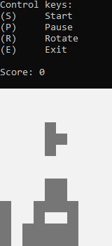

<p align="center">
    
</p>

# WildTetris
[](https://github.com/MartinKondor/WildTetris)
[](https://github.com/MartinKondor/WildTetris)
[](https://github.com/MartinKondor/WildTetris/issues)

[](https://opensource.org/licenses/MIT)

WildTetris is a simple console based tetris game built in C++ for windows.

## Getting Started

### Prerequisites

* Windows 7/8/8.1/10 operating system
* GCC Compiler with C++ 17
* Make (optional)

### Building or Installing

Run:
```bash
> make build
```

Then go to the `bin` folder, and start the game with the file called `wildtetris.exe`. Or run:

```bash
> .\bin\wildtetris.exe
```

## Deployment

If the building was successful and the `bin/wildtetris.exe` file were created but the game didn't start or it immediatly crashed, then copy the `libgcc_s_sjlj-1.dll` dll file to the `bin` directory and try again.

## Built With

* [GCC](https://gcc.gnu.org/) - Compiler used
* [Make](https://www.gnu.org/software/make/) - Tool for running commands

## Contributing

This project is open for any kind of contribution from anyone.

### Steps

1. Fork this repository
2. Create a new branch (optional)
3. Clone it
4. Make your changes
5. Upload them
6. Make a pull request here
7. Profit.

## Authors

* **[Martin Kondor](https://github.com/MartinKondor)**

## License

This project is licensed under the MIT License - see the [LICENSE.md](LICENSE.md) file for details
